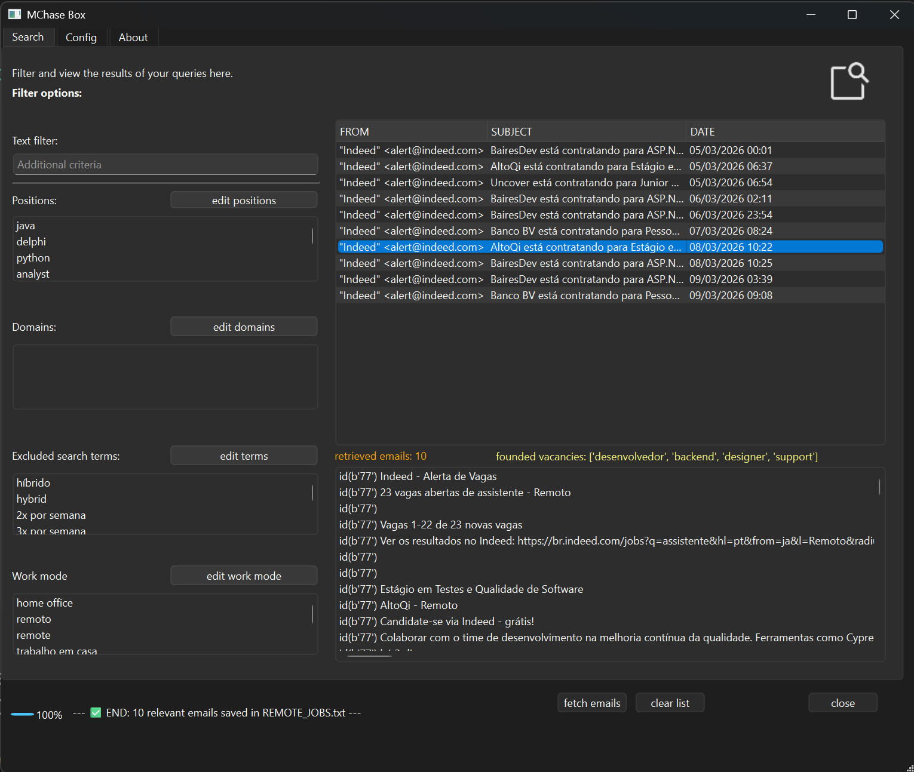
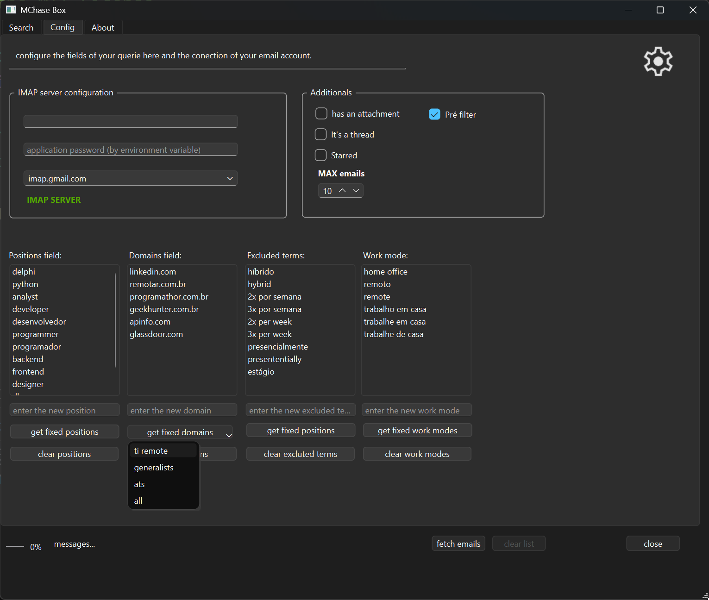
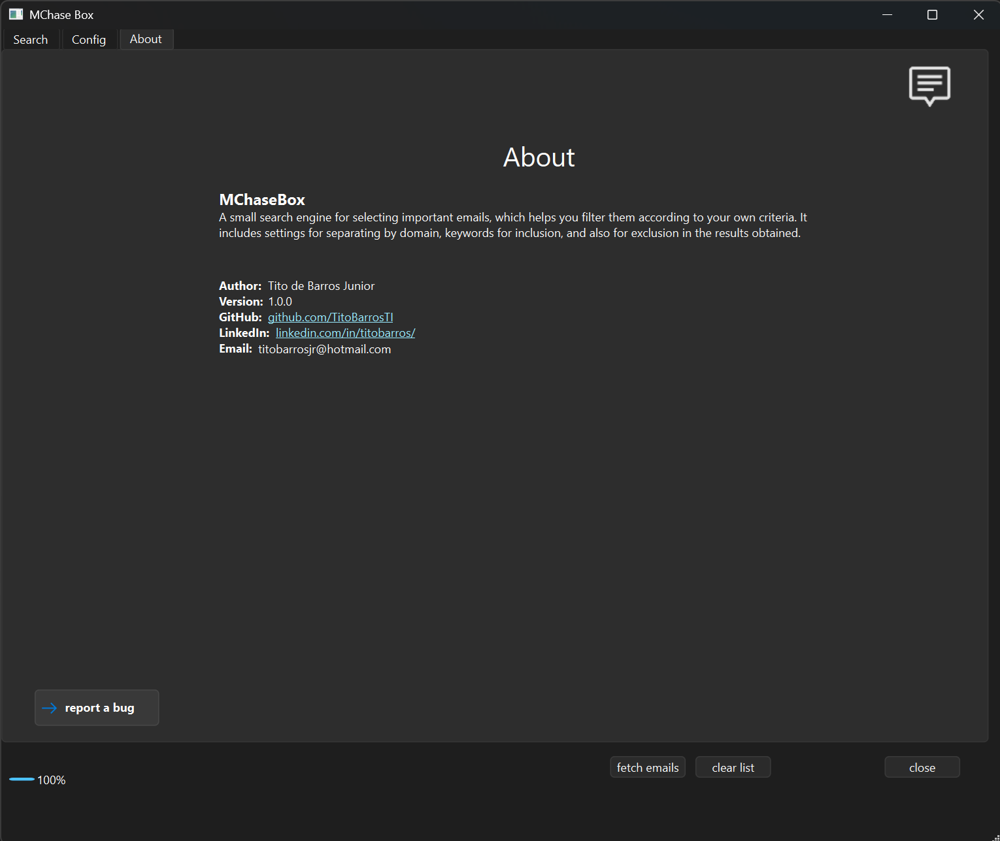

# MCacheBox


---

## 🔎 About

MCacheBox is a lightweight desktop application built with **Python + PySide6**.

It connects to an **IMAP email account** and allows fast searching, filtering, and inspection of emails.
The tool was designed to simplify large mailbox analysis and help users quickly locate relevant messages.

Simple, fast, and focused on productivity.

---

## ✨ Features

```
- IMAP email search
- Multiple filter support
- Fast message listing
- Clean desktop interface
```

## 🔐 Security & Privacy

```
MCacheBox connects to email accounts using the standard IMAP protocol.

The application does not store passwords.
Login credentials are used only to establish the IMAP session.
No data is transmitted to external servers.
All operations occur locally on the user's machine.
For Gmail accounts, an App Password may be required when two-factor authentication is enabled.
```

---

## 🚀 Installation

```bash
git clone https://github.com/titobarrosti/mcachebox.git
cd mcachebox
pip install -r requirements.txt
python main.py
```

---

## 📋 Requirements

Python 3.10+

Main dependency:

```
PySide6
```

Install dependencies with:

```
pip install -r requirements.txt
```

---

## 📁 Project Structure

```
mchasebox/
├── main.py
├── main_window.py
├── imap.py
├── docs/
│   └── (image files...)
├── ui/
│   └── main_window.ui
├── utils/
│   └── imap.py
├── requirements.txt
├── README.md
├── LICENSE
```
## Screenshots

### Search Guide
<a href="docs/screenshots/mchasebox_search.png">
  
</a>

### Config Guide
<a href="docs/screenshots/mchasebox_config.png">
  
</a>

### About Guide
<a href="docs/screenshots/mchasebox_about.png">
  
</a>

---
---

## 📦 Build Executable

To generate a standalone executable:

```bash🔐
pyinstaller --noconsole --onefile main.py
```

---

## 📄 License

MIT License — see LICENSE
